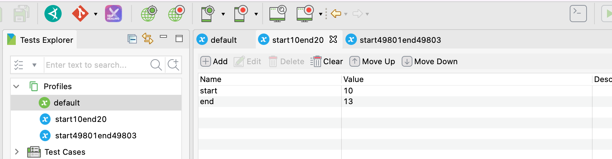
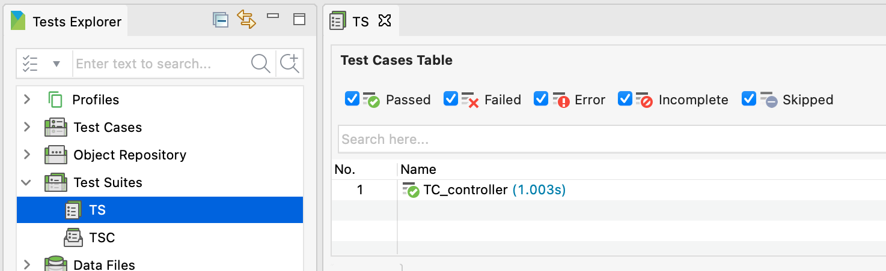
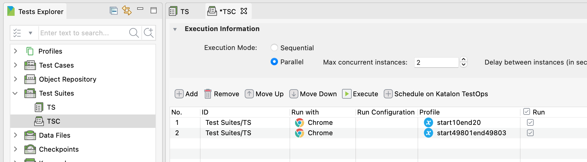

# Processing 50000 lines of test data in Katalon Studio

This is a small Katalon Studio project for demonstration purpose. You can download the zip from the
[Releases](https://github.com/kazurayam/Processing50000/releases/) page.

This project was developed in order to propose a solution to a question raised at the Katalon User Forum:app-name:

-   [Script to create multiple test suiites clone different data iteration](https://forum.katalon.com/t/script-to-create-multiple-test-suites-clone-with-different-data-iteration/60724)

This project was developed using Katalon Studio v8.2.0 on Mac, but would work on any version of Katalon Studio since v7.x on Windows/Linux as well.

## Problem to solve

In Katalon Studio, I have a Test Case which requires some parameters runtime. And I have a CSV file of which lines contain the values to pass to the Test Case.

Let me assume an extreme case: the number of lines is massive: 50,000. If I run the Test Case for 50,000 times sequentially, who knows how long would it take? How many days and nights?

So, I want to somehow split the data into smaller chunks of N groups, and execute N tests in parallel in order to let the tasks to finish faster. N could be 2, 5, 10, 50, …​

I want the codes in the Katalon Studio project as simple and maintainable as possible.

I would start developing the project using Katalon Studio GUI on a laptop machine.

I would imagine distributing the whole task on multiple instances on Cloud with sufficient Katalon Runtime Engine licenses (50 AWS EC2 instances?) as much as the budget allows. With this hope in mind, I want to design the project’s code to run fine in such distributed environment as well as on a laptop.

## Solution

I would not use Katalon’s [Data-driven Testing](https://docs.katalon.com/katalon-studio/docs/ddt.html) feature, because I want to control the data-variable binding myself.

I will build a state-of-the-art combination of Test Cases, Execution Profiles, Global Variables, Test Suites, and Test Suite Collections.

## Scenario

I want to achieve a Input-TestCase-Output sceneario as follows.

### Input

The input CSV file contains 50000 lines with some valuable data.

[data.csv](data.csv)

    seq,data
    1,D2A277
    2,F978BB
    3,F6E6DF
    4,4E5F70
    ...
    49994,4409A6
    49995,ACA72E
    49996,060C62
    49997,984BC2
    49998,602E05
    49999,FFEE73

### Test Case

The following is the "actual test case". I wrote it intensionally simple to make it easy to understand. You can implement whatever tests using `WebUI.xxxxx` keywords as you like here.

This test case expects 2 variables `seq` and `data` are supplied by the caller.

[`Test Case /TC_worker`](Scripts/TC_worker/Script1639098728799.groovy)

    // here, you can do whatever you want to do
    println "${seq} has data ${data}"

### Output

I want to split the data lines into smaller chunks, and apply each to the test case.

When lines of (10..13) is applied, in the console, I want to see this:

    start=10, end=13
    9 has data 11450A
    10 has data 47EE38
    11 has data 408253
    12 has data 5E31FA

And when lines (49801..49803) is applied, I want to see this:

    start=49801, end=49803
    49800 has data 2AE9F4
    49801 has data 3089C4
    49802 has data D21BE2

## Description how the demo project is implemented

### Controller Test Case

I made a Test Case `TC_controller` which reads the `data.csv` file in, determines which lines to process, calles `TC_worker` while passing parameters from the file into the worker.

    import static com.kms.katalon.core.testcase.TestCaseFactory.findTestCase
    import com.kms.katalon.core.webui.keyword.WebUiBuiltInKeywords as WebUI
    import internal.GlobalVariable as GlobalVariable

    int start = GlobalVariable.start
    int end = GlobalVariable.end

    println "start=${start}, end=${end}"

    File data = new File("./data.csv")
    data.eachLine { line, lineNumber ->
        if (start <= lineNumber && lineNumber <= end) {
            List<String> items = line.split(" ") as List
            WebUI.callTestCase(findTestCase("TC_worker"), ["seq": items[0], "data": items[1]])
        }
    }

Please note that `TC_controller` requires runtime parameter `start` and `end`. And it reads the value from `GlobalVariable.start` and `GlobalVariable.end`.

Can you guess what `start` and `end` are? `start` and `end` decides which portion of lines in the `data.csv` file to be processed by this time of Controller execution.

If `start=10` and `end=13` are given, then the controller will call the the worker 4 times while passing the parameters like this:

<table>
<colgroup>
<col style="width: 33%" />
<col style="width: 33%" />
<col style="width: 33%" />
</colgroup>
<thead>
<tr class="header">
<th style="text-align: left;">seq</th>
<th style="text-align: left;">data</th>
<th style="text-align: left;"></th>
</tr>
</thead>
<tbody>
<tr class="odd">
<td style="text-align: left;">
9
</td>
<td style="text-align: left;">
11450A
</td>
<td style="text-align: left;"></td>
</tr>
<tr class="even">
<td style="text-align: left;">
10
</td>
<td style="text-align: left;">
47EE38
</td>
<td style="text-align: left;"></td>
</tr>
<tr class="odd">
<td style="text-align: left;">
11
</td>
<td style="text-align: left;">
408253
</td>
<td style="text-align: left;"></td>
</tr>
<tr class="even">
<td style="text-align: left;">
12
</td>
<td style="text-align: left;">
5E31FA
</td>
<td style="text-align: left;"></td>
</tr>
</tbody>
</table>

`TC_controller` is a sort of **filter** that accepts 50000 lines of data and apply some custom logic to decide which lines to take and which lines to filter out. You can develop any other sophisticated **logic**.

### Execution profiles

-   How can I specify the value of `GlobalVariable.start` and `GlobalVariable.end`?

    -   You want to create Execution Profiles that contain these 2 GlobalVariables where you give the value you want

-   How many Execution profiles do I need to create?

    -   If you want to split the `data.csv` file of 50000 lines into 100 chuncks, you would want to create 100 Execution profiles. Namely `start1end499`, `start500end999`, `start1000end1499`, …​

### Test Suite

I made `Test Suites/TS`, which just calls `Test Cases/TC_controller.tc`. No tricks here.

### Test Suite Collection

I made a Test Suite Collection `TSC`. The `TSC` invokes `TS` while specifying the name of Execution profiles to apply.

-   How many combinations of Execution Profiles with the `TS` can I include in the Test Suite Collection?

    -   As many as you want. If you have created 100 Execution Profiles, you can include all of them here, or select just a few.

-   Can I execute the included combinations in parallel?

    -   Of course, you can try it and see if it runs faster.

## Distributed processing on Cloud servers + KRE

As [document](https://docs.katalon.com/katalon-studio/docs/console-mode-execution.html#general-options) tells, Katalon Runtime Engine accepts command line arguments

-   `-executionProfile start10end20`

-   `-g_start=10`, `-g_end=20`

With KRE, you have a lot more flexibility to control the way how to split the data. You can dynamically generate the command line by any scripting technology you like (bash, python, etc)

If you deploy your test as distributed on AWS, as long as your budget allows, you can run 100 instances in parallel so that your test may finish far faster than a single laptop.

## Filter data and Go

50000 lines of data --- it is too much to apply to a UI tests as one go. I want to dynamically extract some smaller portion of data lines; 10 lines, 50, .. 100 at most. How can I do it?

I wrote `Test Cases/TC_controller_filtering_data.tc`.

    import static com.kms.katalon.core.testcase.TestCaseFactory.findTestCase
    import com.kms.katalon.core.webui.keyword.WebUiBuiltInKeywords as WebUI
    import internal.GlobalVariable

    String pattern = GlobalVariable.DataStartsWithPattern
    println "pattern=${pattern}"

    File data = new File("./data.csv")
    int count = 0
    data.eachLine { line, lineNumber ->
        List<String> items = line.split(" ") as List
        if (items[1].toUpperCase().startsWith(pattern.toUpperCase())) {
            WebUI.callTestCase(findTestCase("TC_worker"), ["seq": items[0], "data": items[1]])
            count += 1
        }   
    }
    println "count=${count}"

When I set `GlobalVariable.DataStartsWithPattern='FF1'` and run this test case, I saw in the console

    pattern=FF1
    2040 has data FF11DA
    4227 has data FF155D
    5264 has data FF1563
    7344 has data FF15AF
    7664 has data FF1908
    11135 has data FF1504
    28194 has data FF1250
    29614 has data FF1A82
    42775 has data FF1083
    48683 has data FF1AFD
    count=10

`TC_controller_filtering_data` extracted 10 lines out of 50000, and called `TC_worker` just 10 times.

The point is that I do not use Katalon’s Data-driven testing feature. I do data-binding for myself; I can design and implement the rule how to filter the smaller chuck out of the mass.
